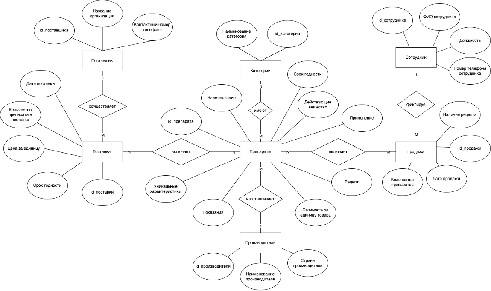
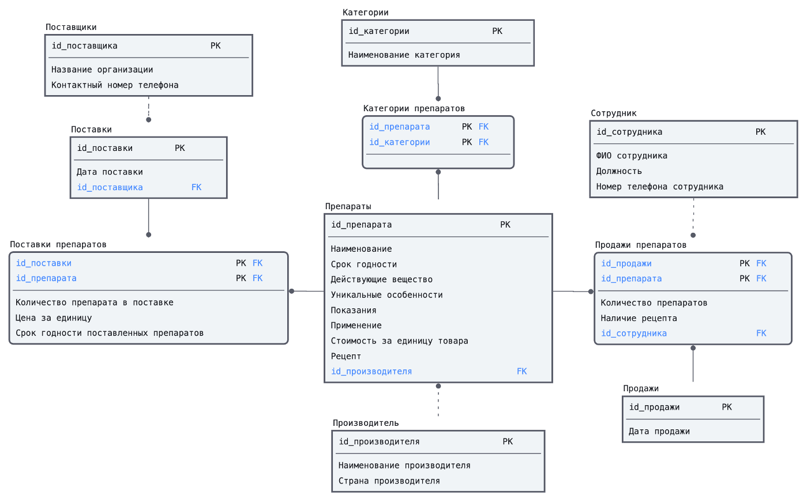
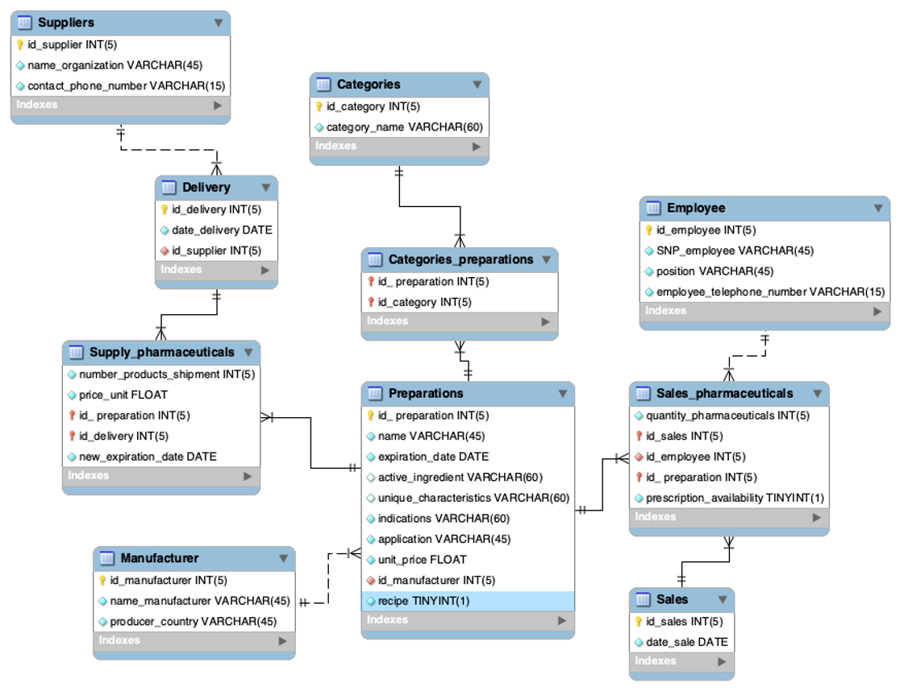

# Pharmacy Database

MySQL database project for a pharmacy management system, developed as a university coursework.

## Subject Area

The database models the operation of a pharmacy: drug inventory, supplier deliveries, employee sales, and prescription tracking.

## Database Schema

### Tables

- **Preparations** — drugs with price, expiration date, indications, and prescription flag
- **Manufacturers** — drug manufacturers with country of origin
- **Categories** — drug categories (e.g. antiviral, cardiovascular)
- **Categories_preparations** — many-to-many link between drugs and categories
- **Suppliers** — supplier organizations
- **Deliveries** — delivery records linked to suppliers
- **Supply_pharmaceuticals** — delivery line items: quantity, price, expiration date per batch
- **Sales** — sale records by date
- **Sales_pharmaceuticals** — sale line items: drug, employee, quantity, prescription availability
- **Employees** — pharmacy staff with position and phone number

### Diagrams

| Conceptual | Logical | Physical |
|---|---|---|
|  |  |  |

## Features

### Triggers
| Trigger | Event | Description |
|---|---|---|
| `check_employee_phone_number` | BEFORE INSERT on Employees | Validates phone number length (11–13 chars) |
| `check_supplier_phone_number` | BEFORE INSERT on Suppliers | Validates phone number length (11–13 chars) |
| `check_prescription_availability` | BEFORE INSERT on Sales_pharmaceuticals | Blocks sale of prescription drugs without a prescription |
| `check_quantity` | BEFORE INSERT on Sales_pharmaceuticals | Blocks sale with 0 quantity |
| `purchase_wholesale` | BEFORE INSERT on Sales_pharmaceuticals | Blocks bulk purchases of 11+ units |
| `update_Supply_pharmaceuticals` | AFTER INSERT on Sales_pharmaceuticals | Decrements stock after a sale |
| `update_date` | AFTER INSERT on Supply_pharmaceuticals | Updates drug expiration date on new delivery |
| `update_price` | AFTER INSERT on Supply_pharmaceuticals | Updates drug price on new delivery |

### Stored Procedures
| Procedure | Description |
|---|---|
| `check(id_sale)` | Returns full receipt for a given sale |
| `delete_zero_shipments()` | Removes depleted stock records |
| `expired_preparations()` | Lists drugs expiring within 1 month |
| `find_employee_with_highest_sales(start, end)` | Returns top-selling employee for a date range |
| `low_stock_preparations()` | Lists drugs with stock below 20 units |
| `search_by_active_substance(substance)` | Searches available drugs by active ingredient |
| `search_by_category(category)` | Searches available drugs by category |
| `search_by_country(country)` | Searches available drugs by manufacturer country |
| `search_by_manufacturer(name)` | Searches available drugs by manufacturer |
| `total_revenue(start, end)` | Calculates total revenue for a date range |

## SQL Files
```
sql/
├── 01_schema.sql      — table definitions
├── 02_data.sql        — sample data
├── 03_procedures.sql  — stored procedures
├── 04_triggers.sql    — triggers
└── 05_queries.sql     — example queries
```

## Getting Started

1. Make sure MySQL is installed and running
2. Clone the repository:
```bash
   git clone https://github.com/lackImagination/pharmacy-db.git
```
3. Run the scripts in order:
```sql
   source sql/01_schema.sql
   source sql/02_data.sql
   source sql/03_procedures.sql
   source sql/04_triggers.sql
```

## Tech Stack

- MySQL 8.0
- SQL (DDL, DML, triggers, stored procedures)
